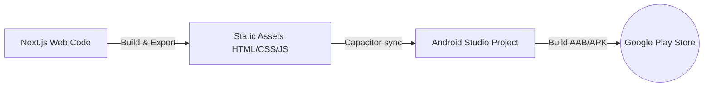
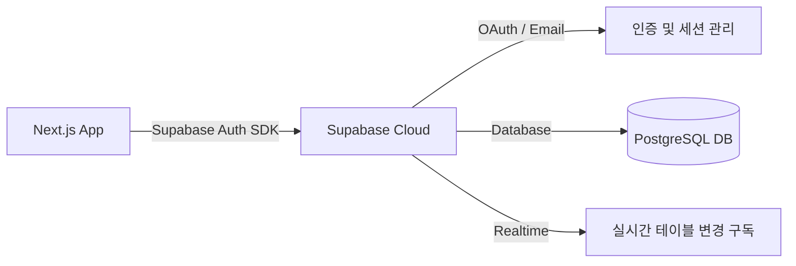
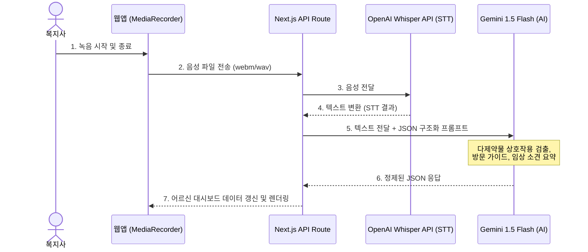
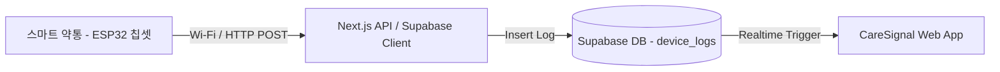

# 케어시그널(CareSignal) 서비스 고도화 기술 제안서

본 제안서는 케어시그널 프로젝트를 프로토타입에서 실제 상용 서비스(또는 해커톤 최종 제출물) 수준으로 발전시키기 위한 **5대 핵심 요구사항**에 대한 구체적인 기술 스택 및 아키텍처 구현 방안을 제시합니다.

---

## 1. 하이브리드 앱 패키징 및 구글 플레이스토어 출시 방안

기존의 Next.js 웹 코드를 최대한 재사용하면서 Android 앱으로 패키징하여 구글 플레이스토어에 업로드하는 가장 효율적인 방식은 **Capacitor**를 사용하는 것입니다.



### 💡 추천 기술: Capacitor (by Ionic)
* **이유**: React Native나 Flutter처럼 코드를 새로 짤 필요 없이, 기존 웹 소스코드 그대로 앱을 빌드할 수 있습니다. 웹 뷰(WebView) 방식으로 구동되며, 구글 헬스 커넥트나 블루투스 등 기기 네이티브 API와의 연동을 돕는 플러그인 생태계가 잘 갖추어져 있습니다.

### 🛠️ 구현 단계
1. **Next.js 정적 내보내기 설정**: `next.config.mjs`에서 `output: 'export'`를 설정하여 정적 빌드(`out/` 폴더 생성)가 가능하도록 만듭니다.
2. **Capacitor 설치 및 초기화**:
   ```bash
   npm install @capacitor/core @capacitor/cli
   npx cap init CareSignal kr.caresignal.app --web-dir=out
   ```
3. **Android 플랫폼 추가**:
   ```bash
   npm install @capacitor/android
   npx cap add android
   ```
4. **빌드 및 동기화**:
   ```bash
   npm run build            # Next.js 정적 파일 빌드
   npx cap sync android     # 웹 코드를 안드로이드 폴더로 복사
   npx cap open android     # Android Studio를 열어 APK/AAB 빌드 및 플레이스토어 릴리즈 준비
   ```

---

## 2. 웨어러블 디바이스 데이터 수집 방안 (수면, 활동량)

스마트 워치(갤럭시 워치, 애플 워치, 핏빗 등)의 헬스 데이터를 수집하는 방법은 **네이티브 OS 통합 방식**과 **클라우드 API 방식**으로 나뉩니다.

```mermaid
graph TD
    subgraph Method1 [1. 안드로이드 OS 통합 방식 (추천)]
        Watch[Galaxy Watch / Fitbit] -->|동기화| HealthConnect[Google Health Connect]
        HealthConnect -->|Capacitor Plugin| App[CareSignal App]
    end

    subgraph Method2 [2. 웹/클라우드 API 연동 방식]
        FitbitCloud[Fitbit Cloud Server] -->|OAuth 2.0 Web API| CareSignalServer[CareSignal Backend]
        CareSignalServer -->|JSON 데이터 제공| App
    end
```

### 💡 추천 방안

#### 방안 A: Google Health Connect (안드로이드 네이티브 앱용 - 추천 ⭐)
* **개념**: 구글이 안드로이드 OS에 내장한 헬스 데이터 통합 허브입니다. 갤럭시 워치(삼성 헬스), 픽셀 워치, 핏빗 등이 수집한 수면 상태 및 걸음 수 데이터를 한곳에 모아주며, 앱은 단 하나의 API로 모든 워치의 데이터를 읽을 수 있습니다.
* **장점**: 사용자가 사용하는 스마트워치 브랜드에 구애받지 않고 통합 수집이 가능합니다.
* **연동 방법**: Capacitor용 플러그인(`@awesome-cordova-plugins/health` 등)을 사용하여 안드로이드 네이티브 권한 획득 후 수면(`SleepSessionRecord`), 걸음 수(`StepsRecord`) 데이터를 가져옵니다.

#### 방안 B: Fitbit API 연동 (순수 웹 환경/해커톤 데모용 ⭐)
* **개념**: 핏빗(Fitbit) 클라우드 서버와 OAuth 2.0으로 연동하여 사용자의 수면/심박수 데이터를 API로 긁어옵니다.
* **장점**: 네이티브 앱 코딩 없이 **웹 환경에서도 작동**하므로 개발 리소스가 가장 적게 듭니다.
* **연동 방법**: 사용자가 대시보드 내 "웨어러블 연동"을 눌러 핏빗 로그인을 완료하면, 백엔드에서 핏빗 API(`https://api.fitbit.com/1.2/user/-/sleep/date/...`)를 호출해 데이터를 수집합니다.

---

## 3. 회원가입 및 로그인 기능 구현 (백엔드 아키텍처)

해커톤의 제한된 기간에 백엔드 API, 보안 규격(암호화), 세션/토큰 처리 및 DB 설계를 가장 빠르게 완성할 수 있는 서비스로 **Supabase**를 강력 추천합니다.



### 💡 추천 기술: Supabase (Serverless Postgres)
* **이유**: Firebase의 관계형 DB(PostgreSQL) 버전으로, 인증(Auth)과 데이터베이스(DB)를 코드 몇 줄로 생성해 줍니다. 특히 Next.js와의 궁합이 매우 좋으며, **실시간 웹소켓(Realtime)** 기능이 제공되어 스마트 약통 등의 상태 변화를 즉각 대시보드에 반영하기 수월합니다.

### 🛠️ 구현 단계
1. **Supabase 프로젝트 생성**: [Supabase 공식 홈페이지](https://supabase.com)에서 프로젝트를 생성하여 API Key와 DB를 할당받습니다.
2. **패키지 설치**:
   ```bash
   npm install @supabase/supabase-js @supabase/ssr
   ```
3. **인증 코드 작성**:
   * 회원가입: `supabase.auth.signUp({ email, password })`
   * 로그인: `supabase.auth.signInWithPassword({ email, password })`
4. **테이블 설계**:
   * `profiles`: 복지사 정보 (이름, 소속 센터 등)
   * `patients`: 어르신 정보 (이름, 나이, 주소, 위험점수 등)
   * `device_logs`: 스마트 약통 개폐 이력 및 웨어러블 수면 로그

---

## 4. 실시간 음성 녹음 및 STT / Gemini AI 구조화 기능

사회복지사가 현장에서 말로 기록을 남기면 실시간으로 텍스트화되고, 이를 제미나이가 구조화하여 대시보드에 입력하는 흐름은 다음과 같이 설계합니다.



### 💡 세부 구현 방안

#### 1단계: 브라우저 음성 녹음
* HTML5 표준인 **MediaRecorder API**를 사용하여 브라우저에서 마이크 권한을 획득하고 음성 데이터를 캡처합니다.
* 완료 시 오디오 Blob 데이터를 생성합니다.

#### 2단계: STT (Speech-to-Text) API 연동
* 녹음된 오디오 파일(Blob)을 백엔드로 보낸 뒤, **OpenAI Whisper API** 또는 **Google Cloud Speech-to-Text API**를 호출해 정밀하게 받아씁니다.

#### 3단계: Gemini API 구조화 및 분석 (가장 핵심 ⭐)
* 텍스트화된 대화 기록을 **Gemini 1.5 Flash** 모델로 전송합니다.
* **Structured Outputs (구조화된 출력/JSON 모드)** 기능을 설정하여 고정된 스키마 형식으로 응답을 받습니다.

##### 📝 제미나이 프롬프트 예시:
```json
{
  "system_instruction": "당신은 요양 전문가이자 임상 분석가입니다. 제공된 음성 기록 텍스트를 정밀 분석하여, '감지된 증상', '원인 결론', '복지사 방문 행동 지침(3~4개)', '의료진용 리포트'를 한글 JSON으로 제공하십시오.",
  "response_mime_type": "application/json",
  "response_schema": {
    "type": "OBJECT",
    "properties": {
      "symptom": { "type": "STRING" },
      "conclusion": { "type": "STRING" },
      "confidence": { "type": "INTEGER" },
      "careGuide": { "type": "ARRAY", "items": { "type": "STRING" } },
      "clinicalReport": { "type": "STRING" }
    }
  }
}
```

---

## 5. 스마트 약통 하드웨어 연동 및 실시간 알림 방안

어르신이 실제 스마트 약통을 열고 닫는 이벤트를 웹 대시보드에서 실시간으로 인지하려면 **IoT 디바이스 -> 클라우드 DB -> 웹 클라이언트**의 실시간 데이터 파이프라인이 필요합니다.



### 💡 추천 하드웨어 및 통신 프로토콜

1. **스마트 약통 디바이스 구성 (하드웨어 측면)**
   * **보드**: **ESP32** (Wi-Fi와 블루투스를 지원하며 가격이 5천원 선으로 매우 저렴한 마이크로컨트롤러).
   * **센서**: 약통 뚜껑이 열리면 회로가 차단되는 **마그네틱(자석) 센서** 또는 **리밋 스위치** 부착.
2. **통신 방식**
   * 어르신 댁의 Wi-Fi를 통해 약통이 열릴 때마다 백엔드로 가벼운 HTTP POST 요청을 보냅니다.
   * `POST /api/pillbox-event` 데이터: `{ "device_id": "pill-soonja-01", "event": "open", "timestamp": "2026-06-30T17:50:00Z" }`
3. **실시간 프론트엔드 연동 (Supabase Realtime)**
   * 프론트엔드 코드(Next.js)에서 Supabase의 실시간 테이블 리스너를 실행해 둡니다.
   * 복제 중인 테이블에 로그가 쌓이면 브라우저로 소켓 알림이 오고, 복약 체크리스트의 `done` 상태가 화면 새로고침 없이 **즉시 체크(V)**로 변경됩니다.

---

## 📝 종합 아키텍처 제안 (Full Stack Blueprint)

해커톤 기간 동안 위의 요구사항을 빠르게 개발하기 위한 **아키텍처 세트**는 다음과 같습니다.

* **Frontend**: Next.js (현재 코드) + Capacitor (안드로이드 APK 변환)
* **Backend / DB**: Supabase (인증 + 실시간 DB 서버리스 이용)
* **AI API**: Gemini 1.5 Flash (음성 요약 및 분석 구조화용)
* **STT API**: OpenAI Whisper API (음성 녹음 처리용)
* **IoT**: ESP32 보드 + Wi-Fi 통신 (약통 열림 감지)
